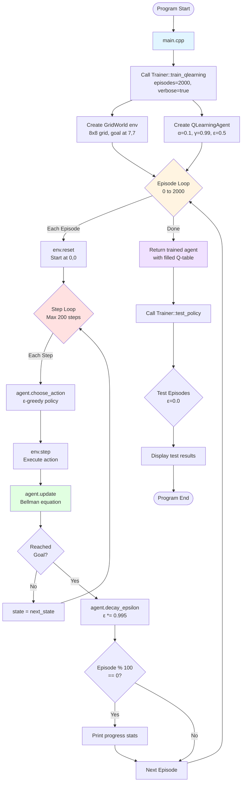
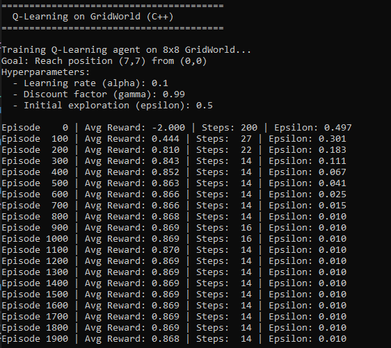
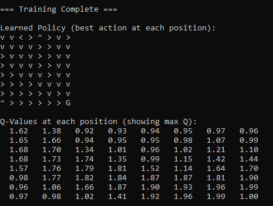
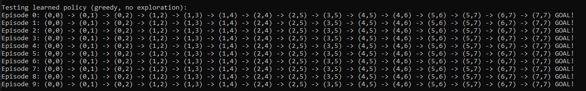

# DQN-Learning-for-Final-Project

## Phase 1: Learning Q-Tables and applying them to Gridworld cpp game.
First steps here are to implement basic q-value tabulating and applying the values therein to a simple DQN Agent.

## Learning Outcomes for Phase 1:
1. Basics of Q-Learning: Q-table, a lookup table mapping (state, action) to expected reward for taking said action.
2. The Bellman equation, and how it updates Q-values.

### Q-values/Q(state, action) = expected sum of all future rewards after taking the given action.

## Hyperparameters needed for Bellman equation:
- Alpha, controls how much to update Q-values based on new experiences. 
- Gamma, determines how much the agent values future rewards compare to immediate ones:
    - High gamma value (0.99) = agent is more forward-thinking and plans ahead.
    - Low gamma (0.1) = agent is myopic and only cares about immediate rewards.
- Epsilon, the rate at which the agent will explore random actions instead of exploiting rewarding actions.
    - Epsilon greedy policy w/ epsilon decay means the agent will start off taking more exploratory actions and gradually decay to exploiting more often.

# Data Flow

## Bellman Equation as it relates to Gridworld:

### newQValue = currentQValue + alpha(reward + gamma * maxNextQValue - currentQValue)

## Learning output after 2000 episodes of traning Q-Learning Agent to play Gridworld:

## Best actions policy applied to 8x8 grid (agent always starts at 0, 0):

## Applying tabulated Q-learning outcomes after 2000 episodes to a fresh agent. Fresh agent always takes shortest 14 steps to goal!
