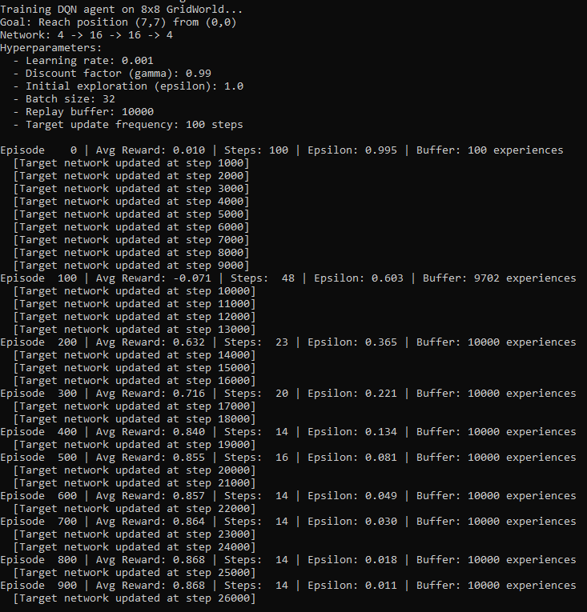
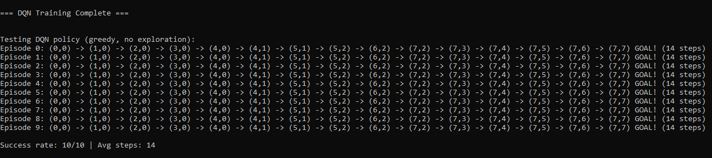
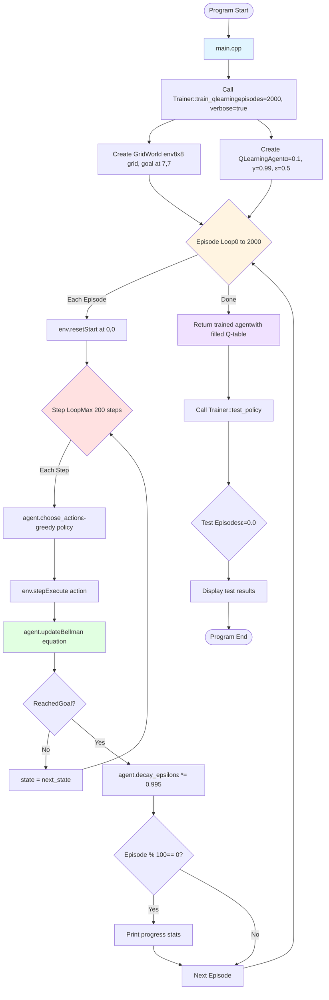
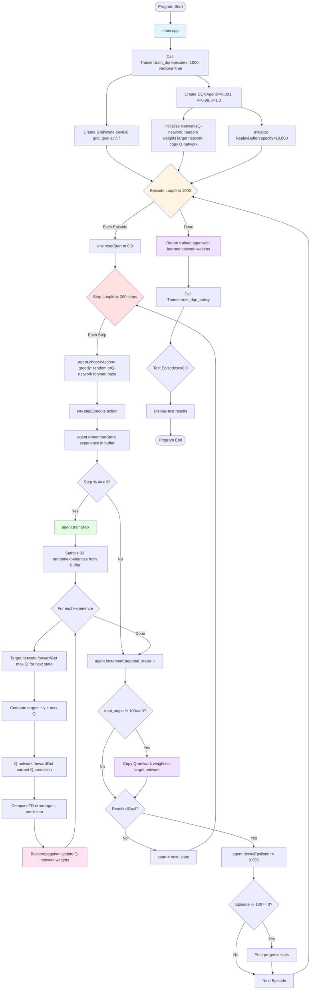

# DQN-Learning-for-Final-Project

## Phase 1: Learning Q-Tables and applying them to Gridworld cpp game.
First steps here are to implement basic q-value tabulating and applying the values therein to a simple DQN Agent.

## Learning Outcomes for Phase 1:
1. Basics of Q-Learning: Q-table, a lookup table mapping (state, action) to expected reward for taking said action.
2. The Bellman equation, and how it updates Q-values.

### Q-values/Q(state, action) = expected sum of all future rewards after taking the given action.

## Hyperparameters needed for Bellman equation:
- Alpha, controls how much to update Q-values based on new experiences. 
- Gamma, determines how much the agent values future rewards compare to immediate ones:
    - High gamma value (0.99) = agent is more forward-thinking and plans ahead.
    - Low gamma (0.1) = agent is myopic and only cares about immediate rewards.
- Epsilon, the rate at which the agent will explore random actions instead of exploiting rewarding actions.
    - Epsilon greedy policy w/ epsilon decay means the agent will start off taking more exploratory actions and gradually decay to exploiting more often.

## Bellman Equation as it relates to Gridworld:

### newQValue = currentQValue + alpha(reward + gamma * maxNextQValue - currentQValue)

## Learning output after 2000 episodes of training Q-Learning Agent to play Gridworld:

## Best actions policy applied to 8x8 grid (agent always starts at 0, 0):

## Applying tabulated Q-learning outcomes after 2000 episodes to a fresh agent. Fresh agent always takes shortest 14 steps to goal!

---

## Phase 2: Neural Network DQN Implementation
Moving beyond tabular Q-learning to deep reinforcement learning with neural networks for function approximation.

## Learning Outcomes for Phase 2:
1. Neural Network Fundamentals: Forward propagation, activation functions (ReLU), and network architecture design.
2. Backpropagation: Computing gradients via chain rule and updating weights with gradient descent.
3. Experience Replay: Breaking temporal correlation by storing and sampling past experiences randomly.
4. Target Networks: Stabilizing learning by using a frozen copy of the Q-network for target Q-value computation.
5. Generalization: Understanding how neural networks learn patterns rather than memorizing exact states.

### Neural Network Architecture: 4 → 16 → 16 → 4
- **Input Layer (4 neurons):** Normalized state features [x/8, y/8, goal_x/8, goal_y/8]
- **Hidden Layer 1 (16 neurons):** ReLU activation, learns spatial distance features
- **Hidden Layer 2 (16 neurons):** ReLU activation, learns action preference patterns
- **Output Layer (4 neurons):** Linear activation, outputs Q-values for [UP, RIGHT, DOWN, LEFT]

## Key Components:

### Experience Replay Buffer
Stores up to 10,000 past experiences as (state, action, reward, next_state, done) tuples. During training, random batches of 32 experiences are sampled to break correlation between consecutive steps.

### Target Network
A separate neural network with frozen weights, updated every 100 steps. Provides stable target Q-values during training:
- **Q-Network:** Updated every step via backpropagation (learns continuously)
- **Target Network:** Updated periodically by copying Q-network weights (provides stability)

### Training Process
1. **Collect Experience:** Agent interacts with environment, stores transitions in replay buffer
2. **Sample Batch:** Randomly sample 32 experiences from buffer
3. **Compute Targets:** Use target network to calculate target Q-values via Bellman equation
4. **Compute Loss:** TD error = target Q-value - predicted Q-value
5. **Backpropagate:** Update Q-network weights to minimize TD error
6. **Update Target:** Every 100 steps, copy Q-network weights to target network

## Hyperparameters for DQN:
- Learning Rate (0.001): Controls step size for weight updates during gradient descent
- Gamma (0.99): Discount factor for future rewards (same as Q-Learning)
- Epsilon (1.0 → 0.01): Exploration rate with decay (0.995 per episode)
- Batch Size (32): Number of experiences sampled per training step
- Replay Buffer (10,000): Maximum experiences stored
- Target Update Frequency (100 steps): How often to sync target network with Q-network

## DQN vs Q-Learning Comparison:

| Aspect | Q-Learning | DQN |
|--------|------------|-----|
| **Memory** | Stores exact Q-values for each (state, action) pair | Stores network weights (384 parameters) |
| **Generalization** | Cannot handle unseen states | Generalizes to similar states via learned features |
| **Scalability** | Memory grows with state space size | Fixed memory regardless of state space |
| **Training Speed** | Fast (2000 episodes, ~2 seconds) | Slower (5000 episodes, ~1-2 minutes) |
| **Convergence** | Stable, slow improvement | Noisier, may show temporary regression |
| **Best For** | Small, discrete state spaces | Large, continuous, or high-dimensional spaces |

## Learning output after 1000 episodes of training DQN Agent:
DQN discovers optimal 14-step paths but through different routes than Q-Learning due to random weight initialization and sampling. Each training run might find a unique optimal policy (all equally valid).

## Testing DQN policy (epsilon = 0.0, pure exploitation):
DQN achieves 100% success rate with optimal 14-step paths, matching Q-Learning's performance while demonstrating neural network function approximation.

## Structure of Netowrk, Inputs, and Learning Output after 1000 episodes of training Q-Learning Agent to play Gridworld:

## DQN Training Completed, Applied Learned Experiences to Fresh Agent playing Gridworld:

---

# Data Flow - Phase 1 (Q-Learning)

# Data Flow - Phase 2 (DQN)

---

## Next Steps: Phase 3 - Five Realms Card Game
Apply DQN to a complex card game environment:
- **State Space:** Hand cards, board state, resources, opponent information (~100 features)
- **Action Space:** Play card, attack, end turn (~50+ actions)
- **Network Architecture:** Larger network {100, 256, 256, 128, 50}
- **Training:** Self-play with 50,000+ episodes
- **Evaluation:** Export checkpoints for difficulty scaling, analyze card win rates for balance